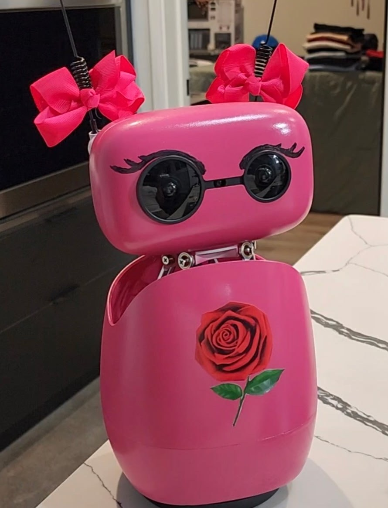

# reachy-rose

Rose is a Reachy Mini Wireless robot whose speech recognition, language model, and voice run on a Mac mini in the same house, with no cloud service in the conversation. This repo contains the configuration that runs her, an example persona, and a guide to running a Reachy Mini on your own hardware, built from what worked and what failed while building her.

Rose was built for teaching and outreach with the [Finley Robotics Initiative](https://accesstorobotics.org/), a Georgia nonprofit. Her sibling robot, Aiden, runs on a cloud backend: [reachy-aiden](https://github.com/reijinarudo/reachy-aiden).

**Start here:** [Running a Reachy Mini Locally: What We Learned Building Rose](docs/running-rose-locally.md). It covers the memory budget, model choice, context settings, what slowed Rose down and what fixed it, what to expect compared with a cloud model, and the trade-offs between capability and speed.

## Demo



[Watch Rose in conversation on YouTube (44 seconds)](https://youtu.be/Es0EJx5NEdE). Recorded 22 July 2026 with Rose's brain running on the Mac mini over the home network. She is asked about her bows and the rose on her chest; her persona at the time described both.

## How it works

```
 Reachy Mini (robot)                          Mac mini (same network)
 microphone  -- audio over websocket -->   speech-to-speech, port 8765
                                              Parakeet: speech to text
                                              llama-server, port 8080: Qwen3-VL-4B writes the reply
                                              Kokoro: text to speech
 speaker     <-- audio over websocket --   reply audio
```

The robot's conversation app speaks the OpenAI Realtime protocol. Pointing it at a local server that speaks the same protocol moves the whole conversation onto the Mac.

Measured on Rose: about 4 seconds from the end of a sentence to her first word, with roughly 8 to 9 GB of the Mac's 24 GB in use.

## Hardware

- Reachy Mini Wireless (Raspberry Pi CM4, 4 GB). Rose ran robot software 1.9.0.
- Mac mini M4 with 24 GB of unified memory. Smaller memory leaves little room for the language model alongside the speech models (guide, section 2).
- Both on the same local network.

## Software

| Component | Version on Rose | Role |
| --- | --- | --- |
| macOS | 26.5.1 | Mac operating system |
| llama.cpp `llama-server` (Homebrew) | build 9430 (d48a56eff) | Serves the language model |
| Hugging Face speech-to-speech | 0.2.9 | Speech pipeline in realtime mode |
| mlx, mlx-audio, mlx-lm, mlx-vlm | 0.31.1, 0.4.2, 0.31.1, 0.4.1 | Apple Silicon runtime the speech pipeline uses for its speech models |
| kokoro (Python package) | 0.9.4 | Kokoro text-to-speech support |
| uv | 0.11.19 | Builds the speech pipeline's Python environment |
| Qwen3-VL-4B-Instruct, GGUF Q6_K (Unsloth build) | | Language model with vision |
| Parakeet TDT 0.6B v3 | | Speech to text |
| Kokoro 82M | | Text to speech |
| praat-parselmouth | 0.4.7 | Pitch and formant shift for Rose's voice (optional) |
| Reachy Mini conversation app | robot software 1.9.0 | Runs on the robot |

## Installation

These steps assume the robot is already set up with the official Reachy Mini app and on your network. See the [Reachy Mini documentation](https://huggingface.co/docs/reachy_mini).

### On the Mac

1. Install llama.cpp: `brew install llama.cpp`
2. Install [speech-to-speech](https://github.com/huggingface/speech-to-speech) into a uv environment at `~/speech-to-speech/.venv`, following its README. Add `praat-parselmouth` to the same environment if you want the voice shift.
3. Copy `mac/com.example.reachy-llama.plist` and `mac/com.example.reachy-voice.plist` to `~/Library/LaunchAgents/`, replace `YOUR_USERNAME` in both, and load them:
   ```
   launchctl load ~/Library/LaunchAgents/com.example.reachy-llama.plist
   launchctl load ~/Library/LaunchAgents/com.example.reachy-voice.plist
   ```
   The first start downloads the model, which takes a few minutes.
4. Confirm the model server is up: `curl -s http://127.0.0.1:8080/health`
5. Keep the Mac awake and logging in on its own after a restart (guide, section 8):
   ```
   sudo pmset -a sleep 0
   ```
   Turn on automatic login in System Settings, under Users & Groups.
6. Optional: apply the voice patches in `patches/rose_kokoro_patches.diff` (guide, section 5).

### On the robot

1. Copy `profiles/Rose-example/` to `/home/pollen/profiles/<RobotName>/` and fill in every placeholder in `instructions.txt`.
2. Copy `robot/local-brain.conf` and `robot/profile.conf` to `/etc/systemd/system/reachy-mini-daemon.service.d/` and fill in the placeholders.
3. Apply the settings:
   ```
   sudo systemctl daemon-reload
   sudo systemctl restart reachy-mini-daemon
   ```

## Configuration

There are no API keys. Everything runs on your network. The settings to change are:

- the Mac's name in `robot/local-brain.conf`
- the persona files in `profiles/`
- the model, context length, and sampling settings in `mac/com.example.reachy-llama.plist`
- the voice and the silence threshold (`--min_silence_ms`) in `mac/com.example.reachy-voice.plist`

The guide explains what each setting costs and buys.

## Usage

Say the robot's name, then your question: "Rose, what do you see?" She answers only when addressed by name, and replies with silence to speech meant for someone else.

Ask her to turn her camera on before asking what she sees. On the local model, she can describe a room she has not looked at (guide, section 5).

## Project layout

```
README.md
LICENSE
docs/running-rose-locally.md        The guide
mac/                                launchd agents for the model server and speech pipeline
robot/                              systemd drop-ins for the Reachy Mini
profiles/Rose-example/              Example persona, greeting, tool list, and voice
patches/rose_kokoro_patches.diff    Voice patches for speech-to-speech's Kokoro handler
```

## Modifications

What this project adds to the upstream software:

- A working configuration that moves a Reachy Mini's conversation from a cloud service onto a Mac mini on the home network, using the conversation app's existing realtime connection settings.
- Model, context, and sampling settings chosen by testing Qwen3 models from 4B to 30B on a 24 GB Mac mini with the voice pipeline running.
- Four patches to speech-to-speech's Kokoro handler: strip markdown symbols before speech, stay silent on wordless replies, pin the startup voice, and shift pitch and formants for a younger voice.
- A persona written for a small local model, using concrete example replies, name-gated listening, and an explicit silent reply.
- Operating practice for a home robot server: launchd agents, sleep and automatic login settings, log placement, and a check order for when the robot goes quiet.
- The guide in `docs/`.

## Credits

| Project | Author | License |
| --- | --- | --- |
| [Reachy Mini](https://huggingface.co/docs/reachy_mini) and the [Reachy Mini conversation app](https://github.com/pollen-robotics/reachy_mini_conversation_app) | Pollen Robotics and Hugging Face | Apache-2.0 |
| [speech-to-speech](https://github.com/huggingface/speech-to-speech) | Hugging Face | Apache-2.0 |
| [llama.cpp](https://github.com/ggml-org/llama.cpp) | ggml-org and contributors | MIT |
| [Qwen3-VL-4B-Instruct](https://huggingface.co/Qwen/Qwen3-VL-4B-Instruct) | Qwen team, Alibaba Cloud | Apache-2.0 |
| [Qwen3-VL-4B-Instruct GGUF](https://huggingface.co/unsloth/Qwen3-VL-4B-Instruct-GGUF) | Unsloth | Apache-2.0 |
| [Parakeet TDT 0.6B v3](https://huggingface.co/nvidia/parakeet-tdt-0.6b-v3) | NVIDIA | CC-BY-4.0 |
| [Kokoro-82M](https://huggingface.co/hexgrad/Kokoro-82M) | hexgrad (training), StyleTTS 2 authors (architecture) | Apache-2.0 |
| [Parselmouth](https://github.com/YannickJadoul/Parselmouth) | Yannick Jadoul, built on Praat by Paul Boersma and David Weenink | GPL-3.0 or later |

This repo distributes none of these projects. Install each one from its source. The patch file modifies a file from speech-to-speech, so the modified file remains under Apache-2.0. The voice shift patch calls Parselmouth, which you install separately under its GPL license.

## License

MIT for the original work in this repo (configuration, persona, patches, and guide). See [LICENSE](LICENSE).

## Contact

Dr. Reginald Finley, contact@drreginaldfinley.com, [drreginaldfinley.com](https://drreginaldfinley.com)
